# ST2DCE-PRJ-2324S9-SE1

<!-- Improved compatibility of back to top link: See: https://github.com/othneildrew/Best-README-Template/pull/73 -->
<a name="readme-top"></a>

<!-- TABLE OF CONTENTS -->
<details>
  <summary>Table of Contents</summary>
  <ol>
    <li>
      <a href="#getting-started">Getting Started</a>
      <ul>
        <li><a href="#prerequisites">Prerequisites</a></li>
        <li><a href="#installation">Installation</a></li>
      </ul>
    </li>
    <li><a href="#jenkins">Jenkins</a></li>
    <li><a href="#prometheus">Prometheus</a></li>
    <li><a href="#grafana">Grafana</a></li>
    <li><a href="#alert">Alert</a></li>
  </ol>
</details>


<!-- GETTING STARTED -->
## Getting Started


### Prerequisites

- Install Docker Desktop 25 via https://docs.docker.com/desktop/install/windows-install/

- Install Helm 
  ```sh
  choco install kubernetes-helm
  ```
  <p align="right">(<a href="#readme-top">back to top</a>)</p>

### Installation

1. copy the content of JenkinFile in the config of a jenkin pipeline
2. add your github credential to clone the git repository
3. open docker desktop
4. launch the pipeline & profit !

<div align="center">
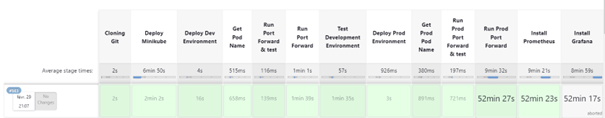
</div>

<p align="right">(<a href="#readme-top">back to top</a>)</p>


## Jenkins
1. Once the pipeline is launched, we need to clone the repository to get all the file needed

<div align="center">
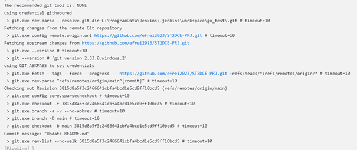
</div>


2. Minikube is then started

<div align="center">
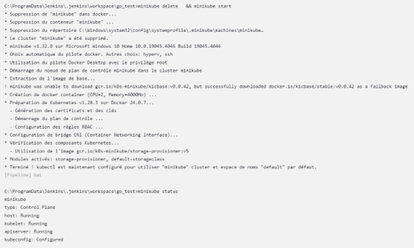
</div>

3. We deploy the webapp image to docker thank to the DockerFile and import it to minikube

<div align="center">
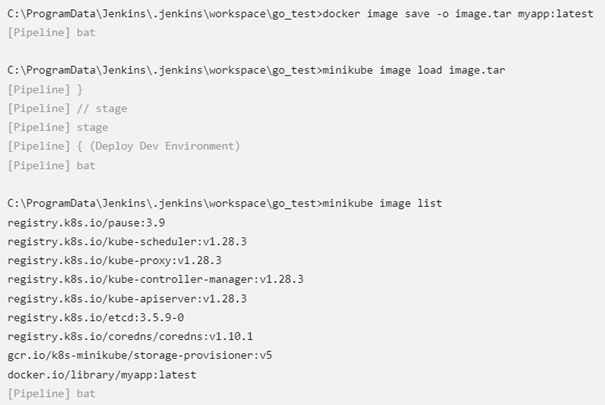
</div>


4. Then the developpement pod is launched

<div align="center">
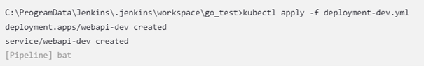
</div>


5. We will need the pod name to forward it to test it so we recover it

<div align="center">
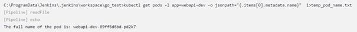
</div>

6. The developpement pod is exposed to 8080:8080 and tested

<div align="center">
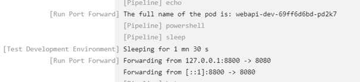
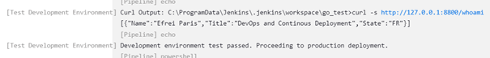
</div>

7. As the test on the developpement pod returned successfull, we can deploy and expose the production pod the same way we did previously

<div align="center">
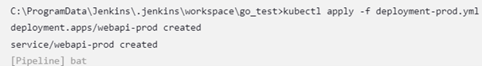
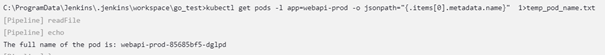
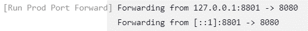
</div>

<p align="right">(<a href="#readme-top">back to top</a>)</p>


## Prometheus

To get prometheus easily on our pipeline, we use a helm chart, slightly modified to represent our need.


1. The pipeline will launch prometheus via the helm chart 

<div align="center">
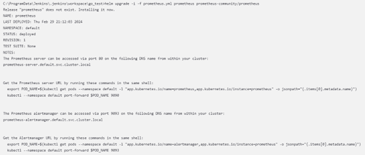
</div>


2. We then retrieve the pod name and expose it to 9090:9090

<div align="center">
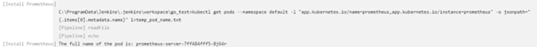
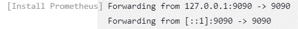
</div>


3. We can now access the prometheus UI and see that our webapp is not linked as it does not possed a ```/metrics``` endpoint

<div align="center">
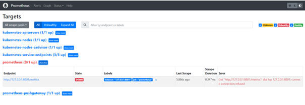
</div>


<p align="right">(<a href="#readme-top">back to top</a>)</p>


## Grafana

1. The pipeline will launch grafana via the helm chart 

<div align="center">
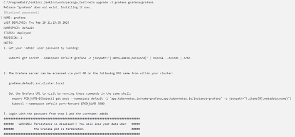
</div>


2. We retrieve the password and decode to access the UI later

<div align="center">
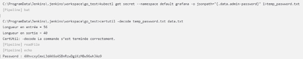
</div>


3. We then retrieve the pod name and expose it to 3000:3000

<div align="center">
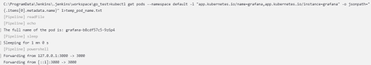
</div>


4. We can now access the grafana UI and add our prometheus URL (http://host.docker.internal:9090) as a data source

<div align="center">
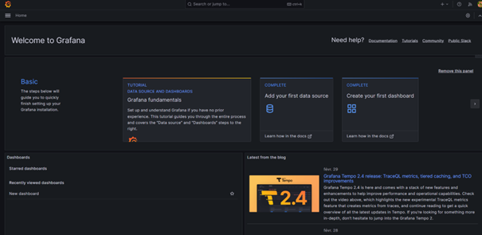
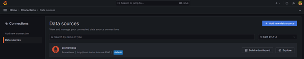
</div>


<p align="right">(<a href="#readme-top">back to top</a>)</p>


## Alert

Our alert node is directly implemented through the custom prometheus file used 

<div align="center">
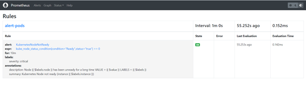
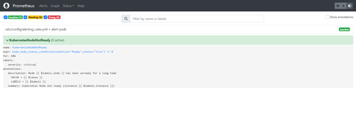
</div>


<p align="right">(<a href="#readme-top">back to top</a>)</p>
